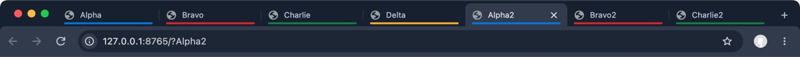

# Plurium

Chromium for macOS where the tabs of **all your profiles** live in one window,
in one tab strip. Work, personal and side-project accounts stay fully isolated
(cookies, logins, extensions), but you see and switch between all their tabs at
once, in any order you like. A line along the top of each tab shows its
profile's theme color.



## Install

Apple Silicon, macOS 13 or later.

```bash
brew tap indapublic/plurium https://github.com/indapublic/plurium
brew trust --cask indapublic/plurium/plurium   # Homebrew 7+ asks to trust third-party taps
brew install --cask indapublic/plurium/plurium
```

Plurium updates itself through Homebrew: when a new version is out, it is
downloaded in the background, and then an **Update** button appears at the
end of the tab strip (and *Plurium → Update
to …* in the menu bar, and *Relaunch* in *About Plurium*). It relaunches like
Chrome does after an update — installing the downloaded version with
`brew upgrade --cask plurium` in between, which takes seconds — and reopens
with all your tabs. The check runs a
minute after launch and every six hours by downloading the cask file from this
repository; *Plurium → Check for Updates…* checks right away. To turn the
automatic checks off:
`defaults write com.indapublic.plurium PluriumAutomaticUpdateChecks -bool NO`.
The update log is `~/Library/Logs/Plurium/update.log`.

Remove with `brew uninstall --cask plurium` (add `--zap` to also delete the
profiles).

The app is signed with a Developer ID and notarized by Apple.

## What it does

- One window for all profiles: each profile's browser window becomes a tab of
  one native macOS window tab group. Their AppKit tab bar is hidden.
- One tab strip with the tabs of all profiles, drawn the same way, with a
  line in the profile color along the top of each tab (the same strip with a
  single window). Right-click a tab or the strip → **Profile Color** for other
  marks: a corner triangle, a line below, a bar on the side, a corner outline
  or none.
  Click to switch (profiles switch as needed), drag to reorder anywhere,
  middle-click or × to close.
- Right-click a tab for Chromium's own tab menu (New Tab to the Right, Reload,
  Duplicate, Pin, Mute Site, Reading List, Show Tabs Vertically, extension
  items, Close…) with a **Plurium** submenu: **Move to** another profile
  (reopens the URL there at the same place), **Profile Color** and **Close
  Other Tabs of** the tab's profile. New tabs and duplicates land next to the
  clicked tab; Close Other Tabs and Close Tabs to the Right follow the shared
  strip, across profiles. Split view isn't in the menu yet. Right-click **+**
  to open a new tab in any profile.
- Pinned tabs of all profiles come first, as narrow tabs with the icon and the
  profile mark (tiles above the other tabs with vertical tabs).
- Tab groups: a group belongs to one profile and its tabs stay together, with
  a header chip and a line in the group's color. Click the header to collapse
  or expand it, right-click it for Chromium's group editor, drag it to move
  the group; drag a tab between the tabs of a group of its profile to add it.
- Chrome's tab shortcuts follow the shared strip: ⌘1…⌘8, ⌘9 (last tab),
  ⌃Tab / ⌃⇧Tab, ⌘⌥← / ⌘⌥→, ⌘⇧[ / ⌘⇧], ⌃PgUp / ⌃PgDn, and ⌃⇧PgUp / ⌃⇧PgDn to
  move a tab. ⌃1…⌃9 jump to the N-th profile.
- ⌘⇧T (and *File → Reopen Closed Tab*) reopens the most recently closed tab
  of any profile — in its own profile and at its old place in the strip, even
  if that profile's window had closed. Closing the active tab activates its
  neighbor in the strip.
- Vertical tabs (*Settings → Appearance → Tab position: Vertical*) show the
  same tabs as a column on the left, with a **+** row under them; collapse,
  resize and expand on hover work as in Chromium. The tab position, collapse
  state and width are shared by all profiles of the window.
- Incognito windows join too ("Work (Incognito)"). DevTools, popups, PWAs and
  dialogs stay separate windows.
- Shared fullscreen for the whole group, with the same strip in fullscreen.
- The order of the strip is kept across restarts.

Set each profile's color in *Customize Chromium → Color*.

## Data

- Profiles: `~/Library/Application Support/Plurium`
- Bundle id: `com.indapublic.plurium` — Plurium does not share data with
  Chromium or Google Chrome installed next to it.

## Limitations

- No Chrome Sync and no signing in to the browser itself (no Google API keys).
  Signing in to websites works as usual.
- No Widevine, so DRM video (Netflix, Spotify Web) does not play.
- Updates come only through new releases of this repository; every Chromium
  security release needs a rebuild.
- In place of Chromium's tab strip you lose hover previews, dragging a tab
  out into a new window, dropping links onto the strip, tab search and split
  view.
- Some built-in texts still say "Chromium".

## Build from source

The patches apply to the stable tag of Chromium they were made for
(currently **154.0.8037.98**):

```bash
mkdir -p /Volumes/Workspace/chromium && cd /Volumes/Workspace/chromium
git clone https://github.com/indapublic/plurium
git clone https://chromium.googlesource.com/chromium/tools/depot_tools.git
export PATH="$PWD/depot_tools:$PATH"
fetch --nohooks chromium && cd src
git fetch origin +refs/tags/154.0.8037.98:refs/tags/154.0.8037.98
git checkout -b profile-tabs tags/154.0.8037.98
git am ../plurium/patches/000*.patch
gclient sync -D --with_branch_heads --with_tags
gn gen out/Release --args='is_debug=false is_component_build=false symbol_level=0 dcheck_always_on=false target_cpu="arm64" proprietary_codecs=true ffmpeg_branding="Chrome"'
autoninja -C out/Release chrome
```

A full build takes about 9 hours on an M1 with 16 GB. For a test build add
`plurium_dev_build=true`: it becomes **Plurium Dev**
(`com.indapublic.plurium.dev`, its own data directory and an orange icon), so
it never mixes with the installed Plurium. The detailed guide
(night build scripts, rebase procedure, checklist, signing) is in Russian:
[README.ru.md](README.ru.md).

| Patch | |
|---|---|
| `0001` | Join profile windows into one native window tab group |
| `0002` | ⌃1…⌃9 select the N-th profile |
| `0003` | Hide AppKit's tab bar, shared fullscreen |
| `0004` | One tab strip with the tabs of all profiles |
| `0005` | Plurium name, bundle id, data directory and icon |
| `0006` | Updates through Homebrew from inside the app |
| `0007` | Choice of the profile color mark (line on top by default) |
| `0008` | ⌘⇧T and the focus after closing a tab follow the unified strip |
| `0009` | The unified strip with vertical tabs |
| `0010` | Chromium's tab menu in the unified strip |
| `0011` | Pinned tabs in the unified strip |
| `0012` | Tab groups in the unified strip |

Releases are made with `tools/release.sh` (Chromium's signing scripts,
notarization, DMG, cask bump).

## License

The patches, scripts and site in this repository are under the
[BSD 3-Clause License](LICENSE). Plurium is a modified build of
[Chromium](https://www.chromium.org/), whose source is under a BSD-style
license; see `chrome://credits` in the app for the licenses of all components. Plurium is not affiliated with or endorsed by
Google. Chromium is a trademark of Google LLC.
